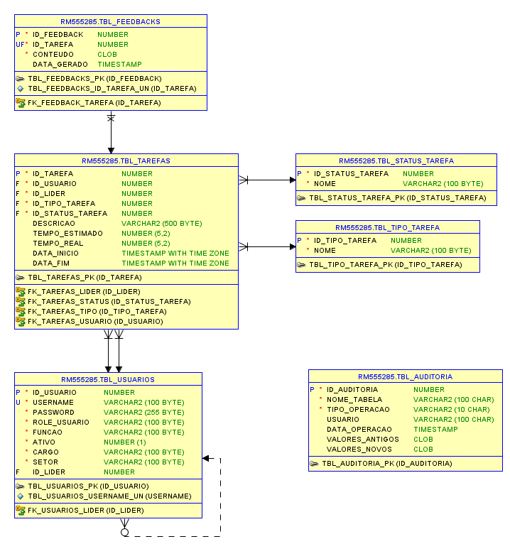

# RESTful API Documentation - TaskMirror

<p>Spring Boot | Java | Maven + React Frontend</p>

## Índice

- [Sobre o TaskMirror](#sobre-o-taskmirror)
- [Integrantes](#integrantes)
- [Tecnologias utilizadas](#tecnologias-utilizadas)
- [Funcionalidades](#funcionalidades)
- [Estrutura do projeto](#estrutura-do-projeto)
- [Dependências utilizadas](#dependencias-utilizadas)
- [Endpoints](#endpoints)
- [Modelo Relacional](#modelo-relacional)
- [Como rodar o projeto](#como-rodar-o-projeto)
- [Deploy no Render](#deploy-no-render)
- [Interface do Administrador](#interface-do-administrador) <!-- INSERIR LINK PARA REPO -->
- [Deploy na Vercel](#deploy-na-vercel) <!-- INSERIR LINK  -->

## Sobre o TaskMirror

TaskMirror é uma aplicação web desenvolvida para facilitar o gerenciamento das tarefas diárias de sua equipe.
Como líder, você pode atribuir atividades aos membros, acompanhar o progresso em tempo real e garantir que os prazos sejam cumpridos.

A plataforma oferece uma interface intuitiva e organizada, permitindo que cada usuário visualize claramente o status das tarefas que lhe foram designadas. Além disso, conta com um painel administrativo completo, onde é possível:

- Gerenciar usuários da aplicação
- Acompanhar métricas inteligentes, como tempo médio de conclusão, produtividade individual e volume de tarefas finalizadas

Para os colaboradores, o TaskMirror disponibiliza uma área dedicada onde podem visualizar e concluir suas tarefas. Por meio de integração com o OLLAMA, também é possível obter feedbacks inteligentes e personalizados sobre o desempenho em cada atividade.

## Integrantes

- André Geraldi Marcolongo - RM555285, 2TDSPV
- Davi Gonzaga Ferreira - RM554890, 2TDSPV
- Victor Nieves Britto Medeiros - RM554557, 2TDSPV

## Tecnologias Utilizadas

- Java JDK 21
- Spring Boot
- Maven 
- React TS (Frontend)
- Ollama Cloud API (gpt-oss:20b-cloud) - geração de feedbacks.

## Funcionalidade implementadas na última versão

| Funcionalidade            | Responsável                                                   | Descrição                                                                                             |
|---------------------------|---------------------------------------------------------------|-------------------------------------------------------------------------------------------------------|
| Gerenciamento de Tarefas  | ROLE_SUPERIOR (Líder)                                         | Criação, atribuição, leitura, atualização e exclusão de tarefas. Visualização da equipe.              |
| Gerenciamento de Usuários | ROLE_ADMIN (Administrador)                                    | Criação, leitura, atualização e desativação de usuários. Visualização de métricas.                    |
| Gerenciamentoe de Tarefas | ROLE_SUBORDINADO  (Membro da equipe, que responde a um líder) | Visualização de tarefas atribuídas, conclusão de tarefas e visualização de feedbacks para cada tarefa |

## Estrutura do projeto

Aplicação backend desenvolvida em Java utilizando Spring Boot, estruturada com Maven. 
O sistema gerencia tarefas, usuários e feedbacks. Integra funcionalidade de IA via OLLAMA para gerar feedbacks a cada conclusão de tarefa.
A aplicação frontend é desenvolvida em React, oferece uma interface administrativa para gerenciar usuários e visualizar métricas, como tempo médio de conclusão de tarefas 
e produtividade individual.

## Dependências utilizadas - Maven

```
<dependencies>
    <!-- Spring Boot Starters -->
    <dependency>
        <groupId>org.springframework.boot</groupId>
        <artifactId>spring-boot-starter-cache</artifactId>
    </dependency>
    <dependency>
        <groupId>org.springframework.boot</groupId>
        <artifactId>spring-boot-starter-data-jpa</artifactId>
    </dependency>
    <dependency>
        <groupId>org.springframework.boot</groupId>
        <artifactId>spring-boot-starter-security</artifactId>
    </dependency>
    <dependency>
        <groupId>org.springframework.boot</groupId>
        <artifactId>spring-boot-starter-validation</artifactId>
    </dependency>
    <dependency>
        <groupId>org.springframework.boot</groupId>
        <artifactId>spring-boot-starter-web</artifactId>
    </dependency>
    <dependency>
        <groupId>org.springframework.boot</groupId>
        <artifactId>spring-boot-starter-webflux</artifactId>
    </dependency>

    <!-- Flyway -->
    <dependency>
        <groupId>org.flywaydb</groupId>
        <artifactId>flyway-core</artifactId>
    </dependency>
    <dependency>
        <groupId>org.flywaydb</groupId>
        <artifactId>flyway-database-oracle</artifactId>
    </dependency>

    <!-- MapStruct -->
    <dependency>
        <groupId>org.mapstruct</groupId>
        <artifactId>mapstruct</artifactId>
        <version>1.5.5.Final</version>
    </dependency>

    <!-- Lombok -->
    <dependency>
        <groupId>org.projectlombok</groupId>
        <artifactId>lombok</artifactId>
        <version>1.18.38</version>
        <optional>true</optional>
    </dependency>
    <dependency>
        <groupId>org.projectlombok</groupId>
        <artifactId>lombok-mapstruct-binding</artifactId>
        <version>0.2.0</version>
    </dependency>

    <!-- Devtools -->
    <dependency>
        <groupId>org.springframework.boot</groupId>
        <artifactId>spring-boot-devtools</artifactId>
        <scope>runtime</scope>
        <optional>true</optional>
    </dependency>

    <!-- Oracle JDBC -->
    <dependency>
        <groupId>com.oracle.database.jdbc</groupId>
        <artifactId>ojdbc11</artifactId>
        <scope>runtime</scope>
    </dependency>

    <!-- Test -->
    <dependency>
        <groupId>org.springframework.boot</groupId>
        <artifactId>spring-boot-starter-test</artifactId>
        <scope>test</scope>
    </dependency>
    <dependency>
        <groupId>org.springframework.security</groupId>
        <artifactId>spring-security-test</artifactId>
        <scope>test</scope>
    </dependency>

    <!-- JWT -->
    <dependency>
        <groupId>io.jsonwebtoken</groupId>
        <artifactId>jjwt-api</artifactId>
        <version>0.12.6</version>
    </dependency>
    <dependency>
        <groupId>io.jsonwebtoken</groupId>
        <artifactId>jjwt-impl</artifactId>
        <version>0.12.6</version>
        <scope>runtime</scope>
    </dependency>
    <dependency>
        <groupId>io.jsonwebtoken</groupId>
        <artifactId>jjwt-jackson</artifactId>
        <version>0.12.6</version>
        <scope>runtime</scope>
    </dependency>

    <!-- Swagger -->
    <dependency>
        <groupId>io.swagger.core.v3</groupId>
        <artifactId>swagger-annotations</artifactId>
        <version>2.2.38</version>
    </dependency>
    <dependency>
        <groupId>org.springdoc</groupId>
        <artifactId>springdoc-openapi-starter-webmvc-ui</artifactId>
        <version>2.6.0</version>
    </dependency>
</dependencies>
```

## Endpoints

A documentação completa dos endpoints da API pode ser acessada via Swagger UI após iniciar a aplicação.

- URL do Swagger UI (localmente): `http://localhost:8080/swagger`
- URL do Swagger UI (deploy no Render): `https://task-mirror-api-java.onrender.com/swagger` <!-- INSERIR LINK ATUALIZADO -->

| Objeto  | Quem executa           | Objetivo                                                            | Método | Endpoint |
|---------|------------------------|---------------------------------------------------------------------|--------|----------|
| Login   | TODOS                  | Autenticar usuário e gerar token JWT                               | POST   | /login |
| Usuario | ADMIN                  | Criar usuário                                                       | POST   | /api/usuarios/admin/criar |
| Usuario | ADMIN                  | Listar todos usuários do sistema                                   | GET    | /api/usuarios/admin/todos-usuarios |
| Usuario | ADMIN                  | Atualizar usuário                                                   | PUT    | /api/usuarios/admin/atualizar/{idUsuario} |
| Usuario | ADMIN                  | Desativar usuário                                                   | PUT    | /api/usuarios/admin/desativar/{idUsuario} |
| Usuario | ADMIN                  | Ativar usuário                                                      | PUT    | /api/usuarios/admin/ativar/{idUsuario} |
| Usuario | ADMIN                  | Listar todos líderes                                                | GET    | /api/usuarios/admin/todos-lideres |
| Usuario | ADMIN                  | Total de usuários ativos                                            | GET    | /api/usuarios/admin/estatistica/total-usuarios-ativos |
| Usuario | ADMIN                  | Produtividade de um subordinado específico                         | GET    | /api/usuarios/admin/estatistica/produtividade/{idUsuario} |
| Tarefa  | ADMIN e SUPERIOR       | Total de tarefas do sistema                                         | GET    | /api/tarefas/estatistica/total-tarefas |
| Tarefa  | ADMIN                  | Total tarefas por status                                            | GET    | /api/tarefas/admin/estatistica/total-tarefas-por-status |
| Tarefa  | ADMIN                  | Tempo médio de conclusão das tarefas                                | GET    | /api/tarefas/admin/estatistica/tempo-medio-conclusao |
| Tarefa  | SUPERIOR               | Criar tarefa                                                        | POST   | /api/tarefas/superior/criar |
| Tarefa  | SUPERIOR               | Atualizar tarefa                                                    | PUT    | /api/tarefas/superior/atualizar/{idTarefa} |
| Tarefa  | SUPERIOR               | Deletar tarefa                                                      | DELETE | /api/tarefas/superior/deletar/{idTarefa} |
| Usuario | SUPERIOR               | Listar equipe (todos subordinados)                                 | GET    | /api/usuarios/superior/equipe |
| Tarefa  | SUPERIOR               | Listar todas tarefas da equipe                                     | GET    | /api/tarefas/superior/tarefas-equipe |
| Tarefa  | SUPERIOR               | Listar tipos de tarefa (dropdown)                                  | GET    | /api/tipo-tarefa |
| Tarefa  | SUPERIOR e SUBORDINADO | Buscar tarefa por ID                                                | GET    | /api/tarefas/{idTarefa} |
| Tarefa  | SUBORDINADO            | Listar tarefas do subordinado logado                                | GET    | /api/tarefas/subordinado/tarefas |
| Tarefa  | SUBORDINADO            | Concluir tarefa + gerar feedback automático                         | PUT    | /api/tarefas/subordinado/concluir/{idTarefa} |
| Usuario | TODOS                  | Retorna dados do usuário por ID                                     | GET    | /api/usuarios/geral/{idUsuario} |

## Modelo Relacional



## Como rodar o projeto localmente
### Clone o projeto
``` shell
git clone https://github.com/andremarko/task-mirror-api-java.git
cd task-mirror-api-java
```
### Configure a conexão com o banco de dados - projeto configurado para persistência em Microsoft SQL Server
#### Adicione o import do env.properties no application.properties

```
spring.application.name=task-mirror-api
spring.config.import=optional:classpath:env.properties
...
...
```
#### Crie o env.properties na pasta src/main/resources e adicione as variáveis de ambiente do banco de dados
```
cd task-mirror-api-java/src/main/resources
touch env.properties
```
#### Configuração mínima:

```
OLLAMA_API_KEY=seu_ollama_api_key
ORACLE_JDBC_CONNECTION_STRING=sua_string_de_conexao_jdbc_mssql_database_aqui
ORACLE_JDBC_USERNAME=seu_usuario_do_banco_aqui
ORACLE_JDBC_PASSWORD=sua_senha_do_banco_aqui
JWT_SECRET=seu_secret_jwt_aqui
EXPIRATION_TIME=seu_tempo_de_expiracao_em_milisegundos_aqui_para_JWT
```

## Deploy no Render
A aplicação está hospedada no Render e pode ser acessada através do link abaixo:
https://task-mirror-api-java.onrender.com/swagger

## Interface do Administrador
a aplicação frontend para a interface do administrador está disponível no repositório: https://github.com/andremarko/task-mirror-admin-interface

## Deploy na Vercel

A interface do administrador está hospedada na Vercel e pode ser acessada através do link abaixo:

https://task-mirror-admin-interface.vercel.app/

### Login na Interface do Administrador

|Login|          |
|----- |----------| 
|Username| admin    
|Senha | senha123 |

